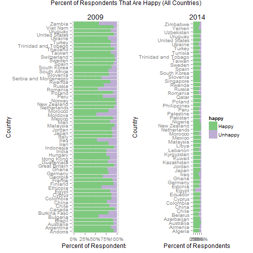

Title: Ben Lee HW1
published: false
tags: hw3
========================================================
## World Values survey

Load in WVS for 2009 and 2014

```r
setwd("C:/Users/blee/Documents/QMSS Fall 2014/Viz")
load("WV5_Data_rdata_v_2014_04_28.rdata")
load("WV6_Data_rdata_v_2014_06_04.rdata")

dat2009<-(WV5_Data_spss_v_2014_04_28)
dat2014<-(WV6_Data_spss_v_2014_06_04)
```

Load in the necessary packages

```r
library(scales)
library(ggplot2)
library(grid)
library(gridExtra)
```


##Research Goal: I want to plot happiness by countries to find out which countries are happiest. Moreover, I'd like to see if there were any changes from 2009 to 2014 for certains countries that went through political changes (Arab Spring).

Create an abridged data set that contains just the variables we need, and explicitly code missing data as NA. 

```r
hap09<-data.frame(V2=dat2009$V2,V10=dat2009$V10)
hap14<-data.frame(V2=dat2014$V2,V10=dat2014$V10)
hap09[hap09$V10 %in% c(-1,-2,-5),2]<-NA
hap14[hap14$V10 %in% c(-1,-2,-5),2]<-NA
```

The country variable is a number, so we need to extract the actual country name from the codebook. This is raw text from the codebook. 


```r
list09<-c("Andorra 1,003 27.8 64.7 5.9 1.0 - 0.6 -","Argentina 1,002 32.4 55.2 9.9 1.4 - 0.4 0.7","Australia 1,421 35.2 56.4 7.1 0.8 - 0.6 -","Brazil 1,500 34.0 56.4 8.8 0.6 - 0.2 0.1","Bulgaria 1,001 10.7 45.7 32.6 8.3 - - 2.8","Canada 2,164 46.2 49.0 3.8 0.6 - 0.1 0.3","Chile 1,000 30.5 49.0 18.6 1.8 - * 0.1","China 1,991 18.8 58.0 19.0 3.5 - 0.1 0.6","Taiwan 1,227 21.6 63.5 11.9 2.9 - - -","Colombia 3,025 48.7 38.2 12.0 0.9 - - 0.3","Cyprus 1,050 36.6 50.4 10.5 2.4 - 0.1 -","Ethiopia 1,500 29.7 33.7 30.7 5.4 - 0.3 0.1","Finland 1,014 29.5 62.5 6.7 1.2 - - 0.1","France 1,001 36.3 53.8 7.6 1.9 - - 0.3","Georgia 1,500 12.1 54.0 28.7 3.9 - 0.1 1.2","Germany 2,064 19.3 61.9 14.1 1.5 - 0.6 2.6","Ghana 1,534 50.1 28.4 17.5 4.0 - 0.1 -","Guatemala 1,000 44.0 34.0 21.6 0.3 - - 0.1","Hong Kong 1,252 6.9 76.7 15.4 0.5 - - 0.6","Hungary 1,007 17.1 58.5 20.8 3.2 0.2 - 0.3","India 2,001 28.9 46.4 21.6 2.7 - - 0.3","Indonesia 2,015 25.2 66.9 6.0 0.5 * 0.8 0.5","Iran 2,667 18.1 61.3 14.8 4.5 - 1.0 0.2","Iraq 2,701 6.2 46.0 28.4 17.1 - 1.4 1.0","Italy 1,012 18.4 71.0 8.6 1.4 - 0.4 0.2","Japan 1,096 28.4 58.9 8.9 1.1 - 2.7 -","Jordan 1,200 29.8 57.1 10.9 2.2 - * -","South Korea 1,200 12.9 74.5 11.7 0.9 - - -","Malaysia 1,201 36.5 58.3 5.1 0.2 - - -","Mali 1,534 39.0 43.6 13.5 2.7 - 0.9 0.3","Mexico 1,560 58.3 32.4 8.3 0.7 - 0.3 0.1","Moldova 1,046 9.7 40.5 34.0 12.8 - - 3.0","Morocco 1,200 24.6 56.2 16.3 2.8 - 0.1 -","Netherlands 1,050 41.8 52.1 5.3 0.5 0.2 0.2 -","New Zealand 954 38.1 58.4 2.5 0.1 - 0.4 0.5","Norway 1,025 36.6 59.7 3.3 0.2 - 0.1 0.1","Peru 1,500 27.9 39.5 30.4 1.8 - 0.5 -","Poland 1,000 21.3 66.4 7.2 1.2 - - 3.9","Romania 1,776 7.3 48.0 36.5 7.4 - 0.1 0.6","Russia 2,033 10.5 55.2 25.9 3.9 0.2 0.6 3.8","Rwanda 1,507 11.9 73.5 12.0 2.4 - 0.3 -","Viet Nam 1,495 22.5 69.0 7.1 0.5 - 0.4 0.5","Slovenia 1,037 17.8 62.0 16.3 2.4 - 0.3 1.2","South Africa 2,988 42.7 35.1 15.7 6.1 - - 0.3","Spain 1,200 13.6 78.4 6.3 1.2 0.2 0.2 0.1","Sweden 1,003 43.0 53.1 3.2 0.5 - 0.2 -","Switzerland 1,241 42.0 51.5 5.6 0.3 - 0.3 0.2","Thailand 1,534 40.2 52.2 6.7 0.6 - 0.3 -","Trinidad and Tobago 1,002 51.7 35.1 11.6 1.7 - - -","Turkey 1,346 37.3 48.8 9.4 4.3 - - 0.1","Ukraine 1,000 11.3 63.3 17.6 5.0 - 0.7 2.1","Egypt 3,051 9.6 73.5 14.8 2.0 - * -","Great Britain 1,041 50.7 42.7 5.2 1.2 - 0.1 0.1","United States 1,249 34.4 58.8 6.4 0.4 - * -","Burkina Faso 1,534 24.1 55.6 15.6 4.0 - 0.2 0.5","Uruguay 1,000 30.3 55.6 11.9 1.7 - 0.5 -","Serbia and Montenegro 1,220 10.2 52.0 30.1 5.2 - 0.5 2.0","Zambia 1,500 17.7 33.9 37.8 - 0.7 0.9 8.9")
list14<-c("Algeria 1,200 17.6 57.9 15.2 3.8 - 5.5 -","Azerbaijan 1,002 27.2 53.4 16.8 2.6 - - -","Australia 1,477 34.9 57.7 6.2 0.5 - 0.7 -","Armenia 1,100 31.2 50.8 12.0 5.1 - 0.1 0.8","Belarus 1,535 10.6 53.1 27.3 3.5 - 1.1 4.4","Chile 1,000 24.4 60.1 14.4 0.8 - 0.2 0.1","China 2,300 15.7 68.8 13.3 1.1 - 0.5 0.7","Taiwan 1,238 26.0 63.9 7.8 1.3 - 0.2 0.8","Colombia 1,512 56.5 35.0 7.9 0.5 - 0.1 -","Cyprus 1,000 25.9 55.8 14.4 3.5 - 0.2 0.2","Ecuador 1,202 57.7 35.3 6.2 0.7 - - -","Estonia 1,533 12.7 64.0 19.9 1.9 - 0.1 1.4","Palestine 1,000 10.3 64.1 19.7 5.5 - - 0.4","Germany 2,046 23.1 60.9 13.4 1.5 - 0.2 1.0","Ghana 1,552 51.0 29.8 15.9 3.3 - - -","Iraq 1,200 10.5 57.5 26.3 4.8 - - 0.9","Japan 2,443 32.3 54.2 9.4 1.0 - - 3.2","Kazakhstan 1,502 31.2 57.3 11.1 0.4 - - -","Jordan 1,200 20.8 65.0 9.8 4.5 - - -","South Korea 1,200 15.2 74.8 9.2 0.7 - 0.1 -","Kuwait 1,303 41.3 50.3 6.4 0.9 - 0.4 0.6","Kyrgyzstan 1,500 36.2 59.7 3.7 0.3 - 0.1 -","Lebanon 1,200 17.9 60.4 19.0 2.2 - 0.5 -","Libya 2,131 38.5 49.0 8.7 2.9 - 0.2 0.7","Malaysia 1,300 56.5 39.5 3.9 - - - -","Mexico 2,000 67.5 26.8 5.3 0.4 - - -","Morocco 1,200 21.0 57.3 15.8 5.6 - 0.2 0.1","Netherlands 1,902 31.9 60.5 6.0 0.6 - - 0.9","New Zealand 841 33.7 58.7 4.3 0.7 - 1.8 0.8","Nigeria 1,759 55.6 29.1 11.6 3.7 - - -","Pakistan 1,200 45.6 39.1 10.9 4.2 - 0.2 -","Peru 1,210 35.1 40.9 22.4 0.9 - - 0.7","Philippines 1,200 49.6 39.8 9.6 1.1 - - -","Poland 966 22.2 70.4 5.3 0.5 - 0.5 1.0","Qatar 1,060 56.4 41.6 1.7 0.3 - - -","Romania 1,503 13.6 55.4 26.4 4.0 - 0.3 0.3","Russia 2,500 14.8 58.5 20.7 1.8 0.1 0.3 3.8","Rwanda 1,527 40.6 49.8 8.5 1.0 - - -","Singapore 1,972 39.1 53.9 6.5 0.5 - - -","Slovenia 1,069 19.5 63.8 14.2 1.8 - 0.5 0.3","Zimbabwe 1,499 39.4 39.5 18.7 2.5 - - -","Spain 1,189 15.5 70.9 12.2 1.1 - - 0.3","Sweden 1,206 40.5 54.1 4.9 0.4 - 0.2 -","Trinidad and Tobago 999 54.2 33.8 11.1 0.9 - - -","Tunisia 1,205 16.7 62.6 15.8 4.7 - - 0.2","Turkey 1,605 37.5 46.3 11.9 3.8 - 0.3 0.2","Ukraine 1,500 16.1 52.0 22.6 4.2 - 0.7 4.3","Egypt 1,523 5.3 20.7 30.1 44.0 - - -","United States 2,232 36.1 53.5 8.8 1.2 - 0.5 -","Uruguay 1,000 34.2 51.8 11.4 2.1 - 0.4 0.1","Uzbekistan 1,500 64.5 31.5 3.3 0.2 - 0.5 -","Yemen 1,000")
```

I used regular expressions to create a unique list of countries for each survey and their corresponding country code. 


```r
t1<-regexpr("[[:alpha:]][[:blank:]][[:digit:]]",list09)
t1b<-regexpr("[[:digit:]][[:blank:]][[:digit:]]",list09)
tab09<-data.frame(substring(list09,1,t1),substring(list09,t1+2,t1b))
tab09$code<-sort(unique(dat2009$V2))

t2<-regexpr("[[:alpha:]][[:blank:]][[:digit:]]",list14)
t2b<-regexpr("[[:digit:]][[:blank:]][[:digit:]]",list14)
tab14<-data.frame(substring(list14,1,t2),substring(list14,t2+2,t2b))
tab14$code<-sort(unique(dat2014$V2))
```

I merged the country names onto the main data files and also appended the year.  


```r
hap09code<-merge(hap09,tab09,by.x="V2",by.y="code")
colnames(hap09code)<- c("V2","V10","Name","pop1")
hap09code<-hap09code[,1:3]
hap09code$year<-"2009"

hap14code<-merge(hap14,tab14,by.x="V2",by.y="code")
colnames(hap14code)<- c("V2","V10","Name","pop1")
hap14code<-hap14code[,1:3]
hap14code$year<-"2014"
```

I created a new variable that creates two buckets for happiness. Those who said they were "very happy" or "rather happy" are grouped as "happy." Those who said that they were "not very happy" or "not at all happy" are grouped as "unhappy."


```r
# Create New Happy Field
hap14code$happy[hap14code$V10 %in% c(1,2)] <- "Happy"
hap14code$happy[hap14code$V10 %in% c(3,4)] <- "Unhappy"
hap14code<-hap14code[hap14code$happy %in% c("Happy","Unhappy"),]

hap09code$happy[hap09code$V10 %in% c(1,2)] <- "Happy"
hap09code$happy[hap09code$V10 %in% c(3,4)] <- "Unhappy"
hap09code<-hap09code[hap09code$happy %in% c("Happy","Unhappy"),]
```

Here is a little peak at our data:

```r
head(hap09code)
```

```
##   V2 V10    Name year happy
## 1 20   2 Andorra 2009 Happy
## 2 20   2 Andorra 2009 Happy
## 3 20   2 Andorra 2009 Happy
## 4 20   1 Andorra 2009 Happy
## 5 20   2 Andorra 2009 Happy
## 6 20   2 Andorra 2009 Happy
```


## Bar Plot that shows the percent of respondents who said they were happy broken out by country and year. 

```r
p1a<-ggplot(hap09code, aes(hap09code[,3],fill=happy)) + geom_bar(position = "fill") + coord_flip() + theme(legend.position = "none")+ scale_y_continuous(labels = percent)+scale_fill_brewer(type = "qual")+
  xlab("Country") + ylab("Percent of Respondents")+ ggtitle("2009")
p2a<-ggplot(hap14code, aes(hap14code[,3],fill=happy)) + geom_bar(position = "fill") + coord_flip() + theme(legend.position = "right")+ scale_y_continuous(labels = percent)+scale_fill_brewer(type = "qual")+
  xlab("Country") + ylab("Percent of Respondents")+ ggtitle("2014")
grid.arrange(p1a, p2a, ncol = 2, main = "Percent of Respondents That Are Happy (All Countries)")
```

 

Not all countries were included in both surveys, so I further cleaned the data to include just the countries that were included in both surveys. Then, I created a new dataset that is a subset of our original.


```r
clist<-c(as.character(unique(hap09code$Name)),as.character(unique(hap14code$Name)))
bothyears<-clist[duplicated(clist)]
hap09codenew<-hap09code[hap09code$Name %in% bothyears,]
hap14codenew<-hap14code[hap14code$Name %in% bothyears,]
```

Here is a list of countries that were included in both surveys. 

```r
bothyears
```

```
##  [1] "Australia"           "Chile"               "China"              
##  [4] "Taiwan"              "Colombia"            "Cyprus"             
##  [7] "Germany"             "Ghana"               "Iraq"               
## [10] "Japan"               "Jordan"              "South Korea"        
## [13] "Malaysia"            "Mexico"              "Morocco"            
## [16] "Netherlands"         "New Zealand"         "Peru"               
## [19] "Poland"              "Romania"             "Russia"             
## [22] "Rwanda"              "Slovenia"            "Spain"              
## [25] "Sweden"              "Trinidad and Tobago" "Turkey"             
## [28] "Ukraine"             "Egypt"               "United States"      
## [31] "Uruguay"
```

## Bar Plot that shows the percent of respondents who said they were happy broken out by the previous list of countries.  

```r
p1b<-ggplot(hap09codenew, aes(hap09codenew[,3],fill=happy)) + geom_bar(position = "fill") + coord_flip() + theme(legend.position = "none")+ scale_y_continuous(labels = percent)+scale_fill_brewer(type = "qual")+
  xlab("Country") + ylab("Percent of Respondents")+ ggtitle("2009")
p2b<-ggplot(hap14codenew, aes(hap14codenew[,3],fill=happy)) + geom_bar(position = "fill") + coord_flip() + theme(legend.position = "right")+ scale_y_continuous(labels = percent)+scale_fill_brewer(type = "qual")+
  xlab("Country") + ylab("Percent of Respondents")+ ggtitle("2014")
grid.arrange(p1b, p2b, ncol = 2, main = "Percent of Respondents That Are Happy (Re-surveyed Countries)")
```

 
