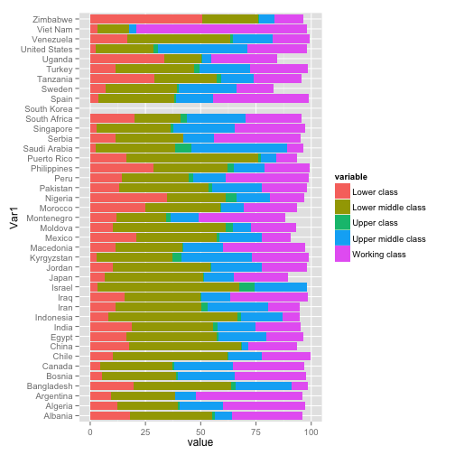

========================================================

```r

library(ggplot2)
# create factors with value labels
mtcars$gear <- factor(mtcars$gear, levels = c(3, 4, 5), labels = c("3gears", 
    "4gears", "5gears"))
mtcars$am <- factor(mtcars$am, levels = c(0, 1), labels = c("Automatic", "Manual"))
mtcars$cyl <- factor(mtcars$cyl, levels = c(4, 6, 8), labels = c("4cyl", "6cyl", 
    "8cyl"))
# Separate regressions of mpg on hp for each number of cylinders
qplot(hp, mpg, data = mtcars, geom = c("point", "smooth"), method = "lm", formula = y ~ 
    x, color = cyl, main = "Regression of MPG on HP", xlab = "Horsepower", ylab = "Miles per Gallon")
```

 

```r
# Separate regressions of mpg on hp for each number of gears
qplot(hp, mpg, data = mtcars, geom = c("point", "smooth"), method = "lm", formula = y ~ 
    x, color = gear, main = "Regression of MPG on HP", xlab = "Horsepower", 
    ylab = "Miles per Gallon")
```

 

```r
# Boxplots of mpg by number of gears
qplot(cyl, mpg, data = mtcars, geom = c("boxplot", "jitter"), fill = cyl, main = "Mileage by cylinder Number", 
    xlab = "cylinder", ylab = "Miles per Gallon")
```

 

```r
# Kernel density plots for mpg grouped by number of cylinders (indicated
# by color)
qplot(mpg, data = mtcars, geom = "density", fill = cyl, alpha = I(0.5), main = "Distribution of Gas Milage", 
    xlab = "Miles Per Gallon", ylab = "Density")
```

 

---
