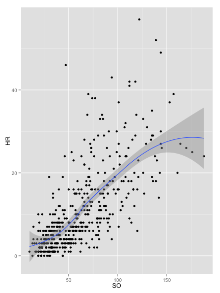
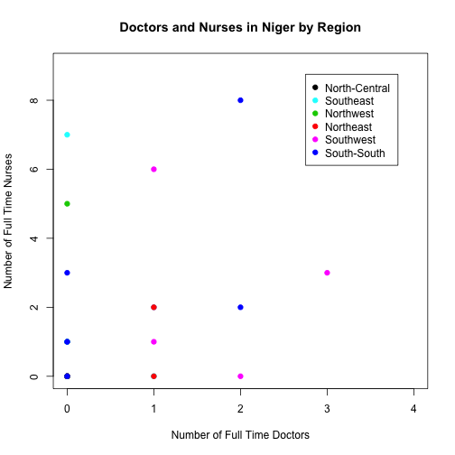
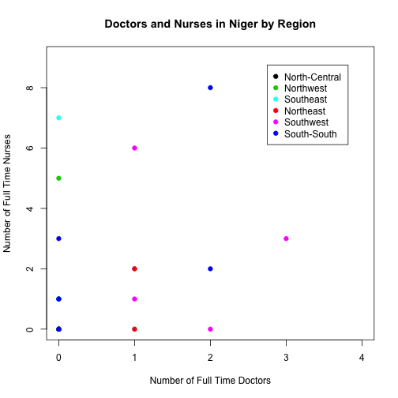

Assignment 1: Rmarkdown, R graphics, and Github
========================================================
I acquired this data from the package UsingR which includes a long list of data sets that are clean and easily accessible.  I have chosen to use the data set "batting" which includes variables such as homeruns, at bats, RBIs, strikeouts, etc.  The first thing that occured to me was to examine the relationship between homeruns and strikeouts.  

In the case below, I wanted to be explicit about a potential relationship between homeruns and strikeouts so I added a line which is easily done using the smooth geom as shown below. Uncertainty in the form of the relationship increases as illustrated by the point-wise confidence interval shown in grey.

```r
library(ggplot2)
library(UsingR)
qplot(SO, HR, data = batting, geom = c("point", "smooth")) + xlab("Strikeouts") + ylab("Homeruns") + ggtitle("Scatter of Homeruns by Strikouts")
```

 

There does seem to be a relationship between strikeouts and homeruns.  There is also appears to be a relationship between strikeouts and doubles, triples, RBIs, etcs.  However, after running a simple multivariate regression strikouts still have a strong relationship with homeruns after controlling for hits and at bats.


```r
lin.reg<-lm(HR ~ SO + H + AB, data = batting)
summary(lin.reg)
```

```
## 
## Call:
## lm(formula = HR ~ SO + H + AB, data = batting)
## 
## Residuals:
##     Min      1Q  Median      3Q     Max 
## -20.065  -3.344  -0.231   2.627  27.421 
## 
## Coefficients:
##             Estimate Std. Error t value Pr(>|t|)    
## (Intercept) -1.90910    0.72271   -2.64   0.0086 ** 
## SO           0.18082    0.01310   13.81  < 2e-16 ***
## H            0.31709    0.02952   10.74  < 2e-16 ***
## AB          -0.07992    0.00958   -8.34  9.6e-16 ***
## ---
## Signif. codes:  0 '***' 0.001 '**' 0.01 '*' 0.05 '.' 0.1 ' ' 1
## 
## Residual standard error: 6.07 on 434 degrees of freedom
## Multiple R-squared:  0.641,	Adjusted R-squared:  0.639 
## F-statistic:  259 on 3 and 434 DF,  p-value: <2e-16
```

Let's take a look at some boxplots to see what the distribution is like for each team.  You'll see that I have highlighted the leader in homeruns in red as well as the median number of homeruns for each team.  


```r
library(doBy)
a<-summaryBy(HR ~ teamID , data=batting, FUN=c(median)) 
ggplot(batting, aes(teamID,HR)) + geom_boxplot() + annotate("text", label = "Alex Rodriquez", x = "TBA", y = 59, size = 5, colour= "red") + xlab("Teams") + ylab("Homeruns") + ggtitle("Distribution of Homeruns") + layer(data = a, mapping =                                                                                                                                        aes(x = teamID, y= a$HR.median+1, label=a$HR.median),                                                                                                                                geom = "text", color="red", size=3.5)
```

 

For the two bargraphs below, I have teams on the horizontal axes and median homeruns and strikeouts on the vertical axes.  I was interested to see what the bargraphs would look like side-by-side to see if this revealed anything more about the relationship.  


```r
library(gridExtra)
b<-summaryBy(HR ~ teamID + lgID, data=batting, FUN=c(median))
NL <- b[which(b$lgID=='NL'),]
d<-summaryBy(SO ~ teamID + lgID , data=batting, FUN=c(median))
NL_S0 <- d[which(d$lgID=='NL'),]
plot1<-ggplot(NL_S0, aes(x=teamID, y=SO.median, fill=teamID)) + geom_bar(stat="identity") + xlab("Teams") + ylab("Median Strikeouts") + ggtitle("Bargraph of Strikeouts by Team")
plot2<-ggplot(NL, aes(x=teamID, y=HR.median, fill=teamID)) + geom_bar(stat="identity") + xlab("Teams") + ylab("Median Homeruns") + ggtitle("Bargraph of Homeruns by Team")
grid.arrange(plot2, plot1, ncol=2)
```

 
========================================================

This is an R Markdown document. Markdown is a simple formatting syntax for authoring web pages (click the **MD** toolbar button for help on Markdown).
