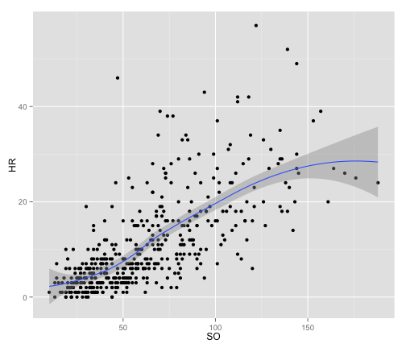

Assignment 1: Rmarkdown, R graphics, and Github
========================================================
I acquired this data from the package UsingR which includes a long list of data sets that are clean and easily accessible.  I have chosen to use the data set "batting" which includes variables such as homeruns, at bats, RBIs, strikeouts, etc.  The first thing that occured to me was to examine the relationship between homeruns and strikeouts.  

In the case below, I wanted to be explicit about a potential relationship between homeruns and strikeouts so I added a line which is easily done using the smooth geom as shown below. Uncertainty in the form of the relationship increases as illustrated by the point-wise confidence interval shown in grey.
 


```r
qplot(SO, HR, data = batting, geom = c("point", "smooth"))
```

```
## geom_smooth: method="auto" and size of largest group is <1000, so using loess. Use 'method = x' to change the smoothing method.
```

 


```r
qplot(teamID, HR, data = batting, geom = "boxplot")
```

 


========================================================

This is an R Markdown document. Markdown is a simple formatting syntax for authoring web pages (click the **MD** toolbar button for help on Markdown).
