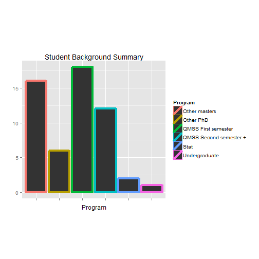

I'm interested in investigating the dataset of health facilities in Niger. The dataset contains  information about the location, number of full-time doctors, nurses, and lab techs, and the management type for 44 health facilities. Some descriptives, including the number of facilities with the value NA for doctors and nurses:

```r
health_full <- read.csv("../../Lab1/sample_health_facilities.csv")
summary(health_full)
```

```
##               lga         lga_id            state               zone   
##  Aliero         : 1   Min.   : 43   Katsina    : 6   North-Central: 7  
##  Anaocha        : 1   1st Qu.:198   Anambra    : 4   Northeast    : 5  
##  Atakunmosa West: 1   Median :418   Delta      : 4   Northwest    :12  
##  Ayamelum       : 1   Mean   :400   Cross River: 3   South-South  : 9  
##  Babura         : 1   3rd Qu.:600   Imo        : 3   Southeast    : 8  
##  Barkin-Ladi    : 1   Max.   :753   Lagos      : 3   Southwest    : 9  
##  (Other)        :44                 (Other)    :27                     
##  c_section_yn    num_nurses_fulltime
##  Mode :logical   Min.   :0.00       
##  FALSE:39        1st Qu.:0.00       
##  TRUE :10        Median :0.00       
##  NA's :1         Mean   :1.02       
##                  3rd Qu.:1.00       
##                  Max.   :8.00       
##                  NA's   :3          
##                                              gps    
##  10.50716994 7.39845258 633.4000244140625 5.0  : 1  
##  11.24467988 5.46029306 360.20001220703125 5.0 : 1  
##  11.266361474990845 4.951384663581848 284.0 4.0: 1  
##  11.62666896 10.71852345 439.8999938964844 8.0 : 1  
##  11.79038088 7.27816887 601.5 5.0              : 1  
##  11.86611734 8.47710532 457.29998779296875 5.0 : 1  
##  (Other)                                       :44  
##  num_lab_techs_fulltime  management num_doctors_fulltime
##  Min.   : 0.00          public:33   Min.   :  0.00      
##  1st Qu.: 0.00          NA's  :17   1st Qu.:  0.00      
##  Median : 0.00                      Median :  0.00      
##  Mean   : 1.21                      Mean   :  6.91      
##  3rd Qu.: 1.00                      3rd Qu.:  1.00      
##  Max.   :41.00                      Max.   :308.00      
##  NA's   :2                          NA's   :3
```
I'd like to graph the number of doctors vs. the number of nurses, but some entries have a value of NA for one or both of those pieces of information. Points with an NA value for the number of doctors or nurses are dropped, a total of 4 points.

```r
table(is.na(health_full$num_doctors_fulltime), is.na(health_full$num_nurses_fulltime))
```

```
##        
##         FALSE TRUE
##   FALSE    46    1
##   TRUE      1    2
```

```r
health <- health_full[!(is.na(health_full$num_doctors_fulltime) | is.na(health_full$num_nurses_fulltime)), ]
```

Here is a scatter plot of doctors vs. nurses. The dot colors refer to the region of the clinic. 

```r
plot(health$num_doctors_fulltime, health$num_nurses_fulltime, main="Doctors and Nurses in Niger by Region", xlab="Number of Full Time Doctors", ylab="Number of Full Time Nurses", xlim=c(0,4), ylim=c(0,9), pch=19, col=health$zone)
legend(2.75, 8.75, unique(health$zone), pch=19, col=unique(health$zone))
```

 

Here is the same plot with the locations labeled:

```r
plot(health$num_doctors_fulltime, health$num_nurses_fulltime, main="Doctors and Nurses in Niger by Region", xlab="Number of Full Time Doctors", ylab="Number of Full Time Nurses", xlim=c(0,4), ylim=c(0,9), pch=19, col=health$zone)
legend(2.75, 8.75, unique(health$zone), pch=19, col=unique(health$zone))
text(health$num_doctors_fulltime, health$num_nurses_fulltime, labels=health$lga, cex= 0.7)
```

 

Showing the same information with ggplot

```r
library(ggplot2)
ggplot(health, aes(num_doctors_fulltime, num_nurses_fulltime, color=zone)) + 
  geom_point(shape=9, alpha=2/3, fill=5) + 
  scale_color_hue(l=50) + 
  labs(x="Number of Full Time Doctors", y="Number of Full Time Nurses") + 
  theme(                              
      plot.background = element_blank(), 
      panel.grid.major = element_blank(), 
      panel.grid.minor = element_blank(), 
      panel.border = element_blank(), 
      panel.background = element_blank(),
      axis.line = element_line(size=.4)
  )
```

 

