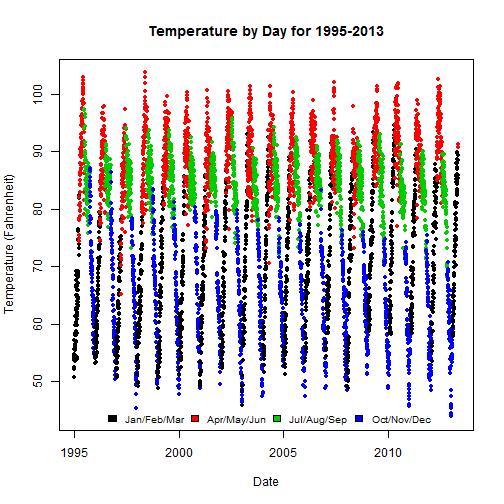
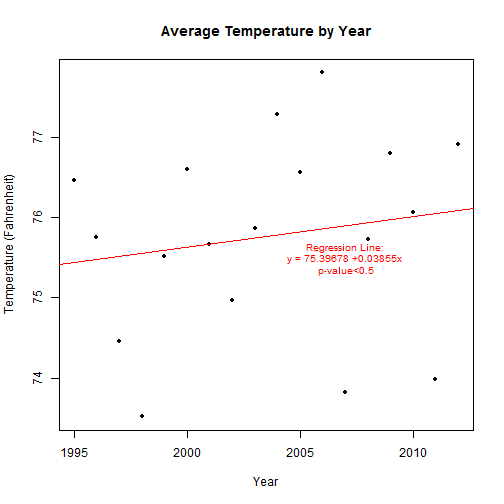

# Data Visualization Homework 1
## Yannan Bu (yb2334)
========================================================

### Dataset: 
    responses-2014-09-05.csv

### Description: 
    This dataset contains information about students of QMSS Data Visualization course collected in the first session on Sept 5, 2014 (http://bit.ly/qmssvizt0). Most of the questions concern about students' basic information and software experience. 

### 1. Preparation: Getting and Cleaning Data

1.1 Read data and have a preliminary sense of the general picture. 

```r
setwd("E:/QMSS/Everything abt R/qmssviz/labs/questionnaire")
data <- read.csv("responses-2014-09-05.csv", header = T, stringsAsFactors = F)
str(data)
```

```
## 'data.frame':	55 obs. of  13 variables:
##  $ Timestamp                                                                                  : chr  "9/4/2014 18:16:46" "9/4/2014 18:17:10" "9/4/2014 18:17:12" "9/4/2014 18:17:30" ...
##  $ Program                                                                                    : chr  "Other PhD" "QMSS Second semester +" "Other masters" "QMSS Second semester +" ...
##  $ Baseline.experience                                                                        : chr  "Excel, Stata, SPSS, dropbox, google drive (formerly docs)" "Excel, SQL, Web: html, css, js" "Excel, R, Stata, SPSS, Rstudio, dropbox" "Excel, R" ...
##  $ Do.you.use.twitter.                                                                        : chr  "No" "Yes" "Yes" "No" ...
##  $ Software.experience..the.smaller.list...R..data.manipulation.and.modeling.                 : chr  "None" "None" "A little" "A little" ...
##  $ Software.experience..the.smaller.list...R..graphics..base..lattice..ggplot2..or.grid..     : chr  "None" "None" "A little" "A little" ...
##  $ Software.experience..the.smaller.list...Reproducible.research..sweave..knitr..ipnb..etc... : chr  "None" "None" "A little" "None" ...
##  $ Software.experience..the.smaller.list...Python.                                            : chr  "None" "None" "None" "None" ...
##  $ Software.experience..the.smaller.list...Version.control..git..mercurial..subversion..etc...: chr  "None" "None" "A little" "None" ...
##  $ Software.experience..the.smaller.list...Databases..any..                                   : chr  "None" "A little" "A little" "None" ...
##  $ Software.experience..the.smaller.list...Web.frontend..html.css.basic.js.jquery..           : chr  "None" "A little" "A little" "None" ...
##  $ Software.experience..the.smaller.list...Serious.javascript..angular.ember.node.d3..        : chr  "None" "None" "A little" "None" ...
##  $ Are.you.on.the.waitlist.                                                                   : chr  "No" "No" "No" "No" ...
```

1.2 Clena data


```r
#Change classe of variable "Program" from character to factor. 
data$Program <- as.factor(data$Program)

table(data$Program)
```

```
## 
##                    EdD          Other masters              Other PhD 
##                      1                     16                      5 
##    QMSS First semester QMSS Second semester +    QMSS third semester 
##                     18                     10                      1 
##    QMSS Third semester                   Stat             Statistics 
##                      1                      1                      1 
##          Undergraduate 
##                      1
```

```r
#Combine "EdD" into the catogory of "Other PhD", "Statistics" into "Stat", and QMSS third semester students to the group "QMSS Second semester+"

data <- as.data.frame(sapply(data, gsub, pattern = "EdD", replacement = "Other PhD"))
data <- as.data.frame(sapply(data, gsub, pattern = "Statistics", replacement = "Stat"))
data <- as.data.frame(sapply(data, gsub, pattern = "QMSS third semester", replacement = "QMSS Second semester +"))
data <- as.data.frame(sapply(data, gsub, pattern = "QMSS Third semester", replacement = "QMSS Second semester +"))


#Tranform multiple choice variable "Baseline.experience" into dichotomous variables.

data <- as.data.frame(sapply(data, gsub, pattern = "cvs, svn, hg, bzr", replacement = "cvs; svn; hg; bzr"))
data <- as.data.frame(sapply(data, gsub, pattern = "ec2, s3", replacement = "ec2; s3"))
data <- as.data.frame(sapply(data, gsub, pattern = "html, css, js", replacement = "html; css; js"))
lev <- levels(factor(data$Baseline.experience))
lev <- unique(unlist(strsplit(lev, ", ")))
name <- gsub(" ", "_", paste(lev, sep = "."))
result <- matrix(data = 0, nrow = length(data$Baseline.experience), ncol = length(lev))
char <- as.character(data$Baseline.experience)
for (i in 1:length(lev)) {
  result[grep(lev[i], char, fixed = T), i] <- 1
}
result <- data.frame(result, stringsAsFactors = T)
colnames(result) <- name
data <- cbind(data, result)


#Create a new variable named "TotalBE" indicating the total number of baseline experience softwares or languages.

data$TotalBE <- rowSums(data[14:45])

#Create a new data frame to sum up the number of students that have previous experience with each software or language.

tools <- as.data.frame(sapply(data[, 14:45], function(v) {
  sel <- as.numeric(v==1)
  sum(sel)
}))
colnames(tools) <- "count"

#And sort the data frame by descending order
tools <- tools[ order(-tools[, 1]), , drop = F]
tools$name <- rownames(tools)
```

### 2. Exploratory Analysis

Note: All the analysis are done with the "ggplot2" package.

```r
library(ggplot2)
```


2.1 Student Background Summary
The first plot shows a histogram of the number of students from each program.

```r
plot1 <- qplot(Program, data = data, color = Program, size = I(1.5), main = "Student Background Summary", ylab = " ")
last_plot() + theme(axis.text.x = element_blank(), title = element_text(size = 12)) + coord_fixed(ratio = 0.3)
```

 

2.2 Baseline Experience Analysis

The second plot demonstrates top 10 most popular computer tools among Data Visualization students.

```r
sub_tool <- tools[10:1, ]
color <- rep(c("light blue", "pink"), 5)
plot2 <- ggplot(sub_tool, aes(x= factor(name, levels=unique(name)), y = count, fill = color)) +
  geom_bar(stat="identity", alpha = 1, position = "identity") +
  coord_flip() +
  xlab(" ") +
  ylab(" ") +
  ggtitle("Top 10 Most Popular Computer Tools among Data Visualization Students") +
  guides(fill = FALSE)
print(plot2)
```

 

The third plot displays number of tools used before of each student, grouped by program.

```r
plot3 <- qplot(Program, TotalBE, data = data, color = Program, geom = "point", ylab = "Total Number of Baseline Experience Tools", main = "Baseline Experience Summary")
last_plot() + theme(axis.text.x = element_blank()) + coord_fixed(ratio = 0.25)
```

 

2.3 Software Experience Analysis

The fourth plot shows distribution of level of students' experience with R graphics.

```r
plot4 <- qplot(data[, 6], data = data, facets = Program ~ ., xlab = "Level of Experience with R Graphics", ylab = " ", main = "Distribution of R Graphics Experience")
last_plot() + coord_fixed(ratio = 0.1)
```

 

The fifth plot is a pie chart of students' version control experience.

```r
plot5 <- ggplot(data, aes(x = factor(1), fill = factor(data[, 9]))) + 
  geom_bar(width = 1) +
  xlab(" ") +
  ylab(" ") +
  ggtitle("Summary of Students' Version Control Experience") +
  scale_fill_discrete("Level of Experience")
plot5 + coord_polar(theta = "y")
```

 
