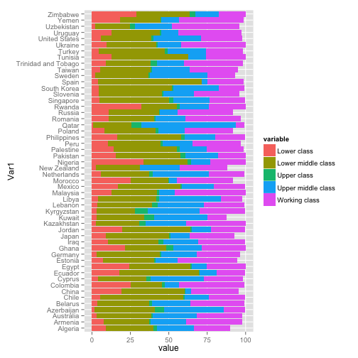

========================================================

```r
setwd("~/Desktop")
install.packages("foreign")
```

```
## Installing package(s) into '/Library/Frameworks/R.framework/Versions/2.15/Resources/library'
## (as 'lib' is unspecified)
```

```
## Error: trying to use CRAN without setting a mirror
```

```r
library(foreign)
```

```
## Warning: package 'foreign' was built under R version 2.15.3
```

```r
# Load World Values Survey Wave 4 Data
data = read.spss("WV4_Data_spss_v_2014-04-28.sav")
```

```
## Warning: WV4_Data_spss_v_2014-04-28.sav: Unrecognized record type 7, subtype 18 encountered in system file
## Warning: WV4_Data_spss_v_2014-04-28.sav: Unrecognized record type 7, subtype 24 encountered in system file
```

```
## re-encoding from UTF-8
```

```
## Warning: duplicated levels will not be allowed in factors anymore
## Warning: duplicated levels will not be allowed in factors anymore
## Warning: duplicated levels will not be allowed in factors anymore
## Warning: duplicated levels will not be allowed in factors anymore
## Warning: duplicated levels will not be allowed in factors anymore
## Warning: duplicated levels will not be allowed in factors anymore
## Warning: duplicated levels will not be allowed in factors anymore
## Warning: duplicated levels will not be allowed in factors anymore
## Warning: duplicated levels will not be allowed in factors anymore
## Warning: duplicated levels will not be allowed in factors anymore
## Warning: duplicated levels will not be allowed in factors anymore
## Warning: duplicated levels will not be allowed in factors anymore
## Warning: duplicated levels will not be allowed in factors anymore
```

```r
# Create proportional tables from data by country I convert the the
# country variable into a string
data$v2 <- as.character(data$v2)
# Create unweighted proportional tables from data
tblB <- as.data.frame(prop.table(table(data$v2, data$v235), 1) * 100)
tbl3 <- tblB[tblB$Var2 %in% c("Lower class", "Lower middle class", "Upper class", 
    "Upper middle class", "Working class"), ]
tbl3$Var2 <- factor(tbl3$Var2, levels = c("Lower class", "Lower middle class", 
    "Upper class", "Upper middle class", "Working class"))
library(reshape2)
orderDat3 <- dcast(tbl3, Var1 ~ Var2, value.var = "Freq")
tblPlot3 <- melt(orderDat3, id.vars = "Var1", measure.vars = c("Lower class", 
    "Lower middle class", "Upper class", "Upper middle class", "Working class"))
# And plot relevelling the levels to match the daulft colors better
tblPlot3$variable <- factor(tblPlot3$variable, levels = c("Lower class", "Lower middle class", 
    "Upper class", "Upper middle class", "Working class"))
library(ggplot2)
ggplot(tblPlot3, aes(x = Var1, y = value, fill = variable)) + geom_bar(stat = "identity") + 
    coord_flip()
```

 

```r
theme(legend.position = "top") + theme(axis.text.x = element_text(size = 14), 
    axis.text.y = element_text(size = 14), legend.text = element_text(size = 14))
```

```
## List of 4
##  $ legend.position: chr "top"
##  $ axis.text.x    :List of 8
##   ..$ family    : NULL
##   ..$ face      : NULL
##   ..$ colour    : NULL
##   ..$ size      : num 14
##   ..$ hjust     : NULL
##   ..$ vjust     : NULL
##   ..$ angle     : NULL
##   ..$ lineheight: NULL
##   ..- attr(*, "class")= chr [1:2] "element_text" "element"
##  $ axis.text.y    :List of 8
##   ..$ family    : NULL
##   ..$ face      : NULL
##   ..$ colour    : NULL
##   ..$ size      : num 14
##   ..$ hjust     : NULL
##   ..$ vjust     : NULL
##   ..$ angle     : NULL
##   ..$ lineheight: NULL
##   ..- attr(*, "class")= chr [1:2] "element_text" "element"
##  $ legend.text    :List of 8
##   ..$ family    : NULL
##   ..$ face      : NULL
##   ..$ colour    : NULL
##   ..$ size      : num 14
##   ..$ hjust     : NULL
##   ..$ vjust     : NULL
##   ..$ angle     : NULL
##   ..$ lineheight: NULL
##   ..- attr(*, "class")= chr [1:2] "element_text" "element"
##  - attr(*, "class")= chr [1:2] "theme" "gg"
##  - attr(*, "complete")= logi FALSE
```

```r
# Repeat procedures for Data for Wave 6
data2 = read.spss("WV6_Data_spss_v_2014_06_04.sav")
```

```
## Error: unable to open file: 'No such file or directory'
```

```r
# Create proportional tables from data by country I convert the variable
# into a string
data2$V2 <- as.character(data2$V2)
```

```
## Error: object 'data2' not found
```

```r
# Create unweighted proportional tables from data
tblC <- as.data.frame(prop.table(table(data2$V2, data2$V238), 1) * 100)
```

```
## Error: object 'data2' not found
```

```r
tbl4 <- tblC[tblC$Var2 %in% c("Lower class", "Lower middle class", "Upper class", 
    "Upper middle class", "Working class"), ]
```

```
## Error: object 'tblC' not found
```

```r
tbl4$Var2 <- factor(tbl4$Var2, levels = c("Lower class", "Lower middle class", 
    "Upper class", "Upper middle class", "Working class"))
```

```
## Error: object 'tbl4' not found
```

```r
library(reshape2)
orderDat4 <- dcast(tbl4, Var1 ~ Var2, value.var = "Freq")
```

```
## Error: object 'tbl4' not found
```

```r
tblPlot4 <- melt(orderDat4, id.vars = "Var1", measure.vars = c("Lower class", 
    "Lower middle class", "Upper class", "Upper middle class", "Working class"))
```

```
## Error: object 'orderDat4' not found
```

```r
# And then the plot relevelling the levels to match the daulft colors
# better
tblPlot4$variable <- factor(tblPlot4$variable, levels = c("Lower class", "Lower middle class", 
    "Upper class", "Upper middle class", "Working class"))
```

```
## Error: object 'tblPlot4' not found
```

```r
library(ggplot2)
ggplot(tblPlot4, aes(x = Var1, y = value, fill = variable)) + geom_bar(stat = "identity") + 
    coord_flip()
```

```
## Error: object 'tblPlot4' not found
```

```r
theme(legend.position = "top") + theme(axis.text.x = element_text(size = 14), 
    axis.text.y = element_text(size = 14), legend.text = element_text(size = 14))
```

```
## List of 4
##  $ legend.position: chr "top"
##  $ axis.text.x    :List of 8
##   ..$ family    : NULL
##   ..$ face      : NULL
##   ..$ colour    : NULL
##   ..$ size      : num 14
##   ..$ hjust     : NULL
##   ..$ vjust     : NULL
##   ..$ angle     : NULL
##   ..$ lineheight: NULL
##   ..- attr(*, "class")= chr [1:2] "element_text" "element"
##  $ axis.text.y    :List of 8
##   ..$ family    : NULL
##   ..$ face      : NULL
##   ..$ colour    : NULL
##   ..$ size      : num 14
##   ..$ hjust     : NULL
##   ..$ vjust     : NULL
##   ..$ angle     : NULL
##   ..$ lineheight: NULL
##   ..- attr(*, "class")= chr [1:2] "element_text" "element"
##  $ legend.text    :List of 8
##   ..$ family    : NULL
##   ..$ face      : NULL
##   ..$ colour    : NULL
##   ..$ size      : num 14
##   ..$ hjust     : NULL
##   ..$ vjust     : NULL
##   ..$ angle     : NULL
##   ..$ lineheight: NULL
##   ..- attr(*, "class")= chr [1:2] "element_text" "element"
##  - attr(*, "class")= chr [1:2] "theme" "gg"
##  - attr(*, "complete")= logi FALSE
```

Sort the final data set by state population, in descending order
```
#Sort the final data set by state population, in descending order
bystate <- aggregate(pop_2006 ~ state, data = nd, sum)
newlgas<-merge(nd,bystate, by ="state")
names(newlgas)[names(newlgas)=="pop_2006.y"]<-"statepop"
newlgas.sort<-newlgas[order(-newlgas$statepop),]
newlgas
```


