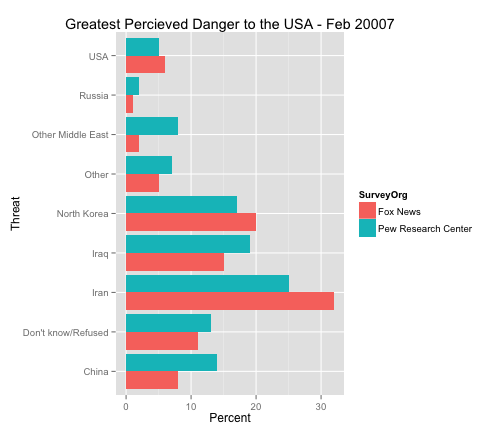
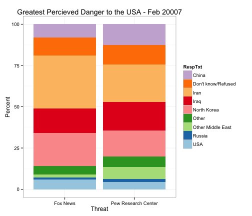
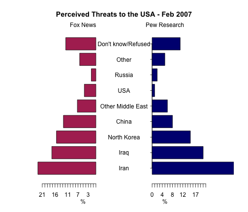

Citizen Percieved Threat
========================================================

Load data of Pew Research and Fox news Surveys.


```r
survey5 <- read.csv("/Users/JonathanCampbell/Desktop/report.csv")


factdate <- function(dfvar){ #fuction to change data type from function to date
  dfvar <- as.character(dfvar)
  dfvar <- as.Date(dfvar, "%m/%d/%Y")
  str(dfvar)
}
str(survey5$ReleaseDate)
```

```
##  Factor w/ 1 level "2/15/07": 1 1 1 1 1 1 1 1 1 1 ...
```

```r
factdate(survey5$ReleaseDate)
```

```
##  Date[1:18], format: "0007-02-15" "0007-02-15" "0007-02-15" "0007-02-15" ...
```

Data Vizualizations:


```r
library(ggplot2)
ggplot(survey5, aes(x=RespTxt, y=RespPct, fill=SurveyOrg)) +
  xlab("Threat") + 
  ylab("Percent") + 
  ggtitle("Greatest Percieved Danger to the USA - Feb 20007")+
  geom_bar(stat="identity", position="dodge") + 
  coord_flip()
```

 


```r
library(RColorBrewer)
df5 <- survey5[order(survey5$RespTxt, decreasing=TRUE),]
p<- ggplot(df5, aes(SurveyOrg, Pct, fill=RespTxt))
p + geom_bar(stat="identity") + scale_fill_manual(values = rev(brewer.pal(9, "Paired"))) + theme_bw()+
  xlab("Threat") + 
  ylab("Percent") + 
  ggtitle("Greatest Percieved Danger to the USA - Feb 20007")
```

 


```r
df5<-data.frame(cbind(as.character(survey5[1:9,1]),survey5[1:9,3],survey5[10:18,3]))
df5[,2] <- as.numeric(as.character(df5[,2]))
df5[,3] <- as.numeric(as.character(df5[,3]))


library(plotrix)
par(mar=plotrix::pyramid.plot(df5[,2],df5[,3],
                              labels=df5[,1], main="Perceived Threats to the USA - Feb 2007",
                              gap=11,lxcol="maroon",rxcol="navy", unit="%",
                              top.labels=c("Fox News"," ", "Pew Research")))
```

 
